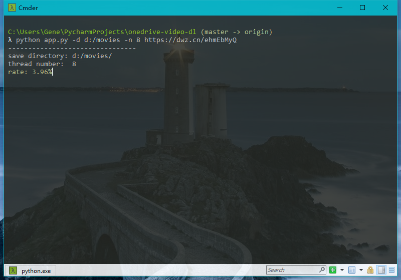

# OneDrive downloader

个人使用OneDrive搭了一个网盘，想在线看视频，但是网速总是不稳定。由于OneDrive可以支持多个连接，（具体最大有多少不清楚）于是采用多线程下载的方法实现视频的边下边播。

## 原理

我是用的多线程并不是平均分成多少段，每段多少M。而是把视频分割成单位为1M的多个片段。按顺序将这些片段的起始地址放到队列里，然后使用多线程消耗，以此达到顺序播放不卡顿的效果。（有些视频格式的索引表在结尾，所以首先下载尾部20M）

## 环境

- `python3`
- `requests>=2.22.0`

## 用法

    $ pip install -r requirements.txt
    $ python app.py -h
    usage: app.py [-h] [-d dir] [-n num] [-c ovd_file] [--set-d dir] [--set-n num]
                  [url [url ...]]

    positional arguments:
      url          download url

    optional arguments:
      -h, --help   show this help message and exit
      -d dir       save directory
      -n num       number of thread
      -c ovd_file  continue to download (TODO) //暂未完成

    settings arguments:
      --set-d dir  set the save directory (default: .)
      --set-n num  set the thread number (default: 8, max: 32)

### 样例

下载电影[彗星来的那一夜][1]到目录`d:/movies`，使用`8`个线程

    python app.py -d d:/movies -n 8 https://dwz.cn/ehmEbMyQ

进度在`2%-3%`就不多就可以使用播放器直接播放了（windows上建议使用[PotPlayer](https://potplayer.daum.net/)），这里自行斟酌

你可以设置默认下载目录和默认线程数

    python app.py -set-d d:/movies --set-n 32

你设置的值会保存到`ovd.ini`配置文件中，上面的命令会写入如下信息

    [config]
    save_dir = d:/movies
    thread_num = 32

如果同时设置参数`-d`和`--set-d`，会将视频保存到参数`-d`设定的路径下，参数`--set-d`设置的路径下次生效

    python app.py https://dwz.cn/ehmEbMyQ -d e:/movies --set-d d:/movies

>这里会将视频下载到`e:/movies`，`-n`和`--set-n`也是如此

[1]: https://dwz.cn/ehmEbMyQ

## 其他

`python app.py -c ovd_file`这个命令的断点续传功能未完成。不过你可以使用相同的命令下载上次没有下载完成的视频，我是通过`.ovd`文件记录下载好的部分的，请不要轻易删除此文件。当视频下载完成后会自动删除，没有`.ovd`文件会重新开始下载整个文件
